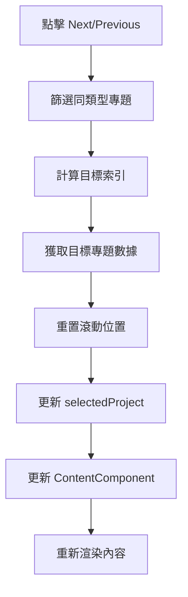

# SidePanel 系統分析文件

## 1. 系統概覽

**核心檔案：**
- **SidePanel.jsx** - 主要容器組件
- **contentMap.js** - 內容路由系統
- **sidepanel-contents/** - 內容組件目錄

**主要功能：**
- 點擊 3D 場景中的物件觸發側邊欄開啟
- 動態載入對應的專題內容
- 提供專題間的導航功能
- 支援圖片、影片等多媒體內容展示

## 2. 系統架構分析

### 2.1 SidePanel 主容器

**檔案位置：** `src/app/components/SidePanel.jsx`  
**行數：** 193 行  
**複雜度：** 中等

#### 2.1.1 核心功能
```javascript
// 主要 Props
const SidePanel = ({ 
  isOpen,                    // 開關狀態
  onClose,                   // 關閉回調
  projectData,               // 專題數據
  ContentComponent,          // 動態內容組件
  contentProps,              // 內容組件 props
  setSelectedProject,        // 專題選擇 setter
  setSidePanelContent        // 內容設定 setter
}) => {
```

#### 2.1.2 狀態管理
```javascript
const [scrollProgress, setScrollProgress] = useState(0);     // 滾動進度
const scrollContainerRef = useRef(null);                     // 滾動容器引用
```

#### 2.1.3 核心特性

**滾動進度追蹤：**
- 實時計算滾動進度 (0-1)
- 視覺化進度條顯示
- ResizeObserver 監聽內容變化

**用戶體驗優化：**
- ESC 鍵關閉功能
- 開啟時防止背景滾動
- 滾動位置自動重置
- 背景點擊關閉

**動畫效果：**
- 300ms 滑入/滑出動畫
- 背景遮罩淡入淡出
- 進度條平滑更新

### 2.2 內容路由系統

**檔案位置：** `src/app/sidepanel-contents/contentMap.js`  
**行數：** 44 行

#### 2.2.1 動態映射機制
```javascript
// 自動建立 ID 到組件的映射
const match = fileName.match(/(Reports|Innovation|Challenge)(\d+)Content\.jsx$/);
const id = `${section}-${number}`;  // 例如: "reports-1"
contentMap[id] = sectionModules(fileName).default;
```

#### 2.2.2 支援的內容類型
- **Reports** (12 個) - 報導專題內容
- **Innovation** (4 個) - 創新項目內容  
- **Challenge** - 挑戰相關內容（預留）
- **Default** - 預設/備用內容

### 2.3 內容組件架構

#### 2.3.1 標準結構
```jsx
const ProjectContent = ({ projectData, onClose, setSelectedProject, setSidePanelContent }) => {
    return (
        <Shared.Container>
            <Shared.ReportBanner />      // 主視覺横幅
            <Shared.Content>
                <Shared.ReportSummary /> // 重點摘要
                <Shared.Description />   // 詳細描述
                <Shared.BtnLink />       // 外部連結
                <Shared.ReportCredits /> // 製作團隊
            </Shared.Content>
            <Shared.BtnNavigation />     // 導航按鈕
        </Shared.Container>
    );
};
```

#### 2.3.2 共用組件系統
**佈局組件：**
- `Container` - 基礎容器
- `Content` - 內容區域包裝
- `Description` - 文字描述區塊

**媒體組件：**
- `ReportBanner` - 支援圖片/影片的主視覺
- `VideoPlayer` - 影片播放器
- `SpotifyPlayer` - Spotify 播放器

**互動組件：**
- `BtnNavigation` - 導航控制組合
- `BtnNext` / `BtnPrevious` - 上/下一項目
- `BtnLink` - 外部連結按鈕

**資訊組件：**
- `ReportSummary` - 重點摘要（支援巢狀結構）
- `ReportCredits` - 製作團隊資訊
- `StackCards` - 卡片堆疊展示

## 3. 互動流程分析

### 3.1 開啟流程
```mermaid
graph TD
    A[用戶點擊3D物件] --> B[觸發點擊事件]
    B --> C[獲取 projectData]
    C --> D[查找 ContentComponent]
    D --> E[設定 sidePanelContent]
    E --> F[setIsSidePanelOpen(true)]
    F --> G[SidePanel 滑入動畫]
    G --> H[載入動態內容]
    H --> I[重置滾動位置]
```

### 3.2 導航流程


### 3.3 關閉流程
```mermaid
graph TD
    A[觸發關閉] --> B[滑出動畫]
    B --> C[背景遮罩淡出]
    C --> D[setIsSidePanelOpen(false)]
    D --> E[恢復背景滾動]
    E --> F[移除鍵盤監聽]
    F --> G[ScrollTrigger.refresh]
```

## 4. R3F 重構挑戰與機會

### 4.1 技術挑戰

#### 4.1.1 狀態管理複雜化
```typescript
// 現有的簡單狀態傳遞
setSidePanelContent({
    ContentComponent,
    contentProps: { projectData }
});

// R3F 重構後需要更複雜的狀態協調
interface SidePanelState {
    isOpen: boolean;
    currentProject: ProjectData | null;
    contentType: string;
    animationState: 'entering' | 'open' | 'exiting' | 'closed';
    scrollProgress: number;
    navigationHistory: string[];
}
```

#### 4.1.2 3D 場景與 2D UI 同步
- **相機狀態同步**：側邊欄開啟時可能需要調整 3D 相機
- **渲染優先級**：側邊欄開啟時降低 3D 場景渲染品質
- **動畫協調**：確保 3D 動畫與側邊欄動畫不衝突

#### 4.1.3 記憶體管理
- **內容預載**：是否需要預載入常用內容組件
- **資源清理**：側邊欄關閉時是否需要清理媒體資源
- **3D 資源優化**：側邊欄開啟時可能需要暫停某些 3D 效果

### 4.2 增強機會

#### 4.2.1 3D 轉場效果
```jsx
// 3D 側邊欄轉場效果
const SidePanel3D = () => {
    const panelRef = useRef();
    
    useFrame((state) => {
        if (isOpen) {
            // 3D 滑入效果，帶景深
            panelRef.current.position.x = THREE.MathUtils.lerp(
                panelRef.current.position.x, 
                0, 
                0.1
            );
        }
    });
    
    return (
        <group ref={panelRef} position={[10, 0, 0]}>
            {/* 3D 側邊欄內容 */}
        </group>
    );
};
```

#### 4.2.2 沉浸式內容展示
```jsx
// 3D 內容預覽
const ContentPreview3D = ({ projectData }) => {
    return (
        <group>
            {/* 3D 模型預覽 */}
            <ContentModel modelPath={projectData.model3D} />
            
            {/* 3D 文字展示 */}
            <Text3D 
                text={projectData.title}
                position={[0, 2, 0]}
                size={0.5}
            />
            
            {/* 互動式媒體 */}
            <InteractiveMedia source={projectData.mediaSrc} />
        </group>
    );
};
```

#### 4.2.3 空間導航系統
```jsx
// 3D 空間中的導航
const SpatialNavigation = ({ projects }) => {
    return (
        <group>
            {projects.map((project, index) => (
                <ProjectOrb
                    key={project.id}
                    position={getSpatialPosition(index)}
                    project={project}
                    onClick={() => navigateToProject(project)}
                />
            ))}
        </group>
    );
};
```

## 5. Zustand 整合方案

### 5.1 SidePanel Slice 設計

```typescript
// stores/slices/sidePanelSlice.ts
export interface SidePanelSlice {
    sidePanel: {
        isOpen: boolean;
        currentProject: ProjectData | null;
        contentComponent: React.ComponentType | null;
        animationState: 'entering' | 'open' | 'exiting' | 'closed';
        scrollProgress: number;
        navigationHistory: string[];
        preloadedContent: Map<string, React.ComponentType>;
    };
    
    // Actions
    openSidePanel: (project: ProjectData) => void;
    closeSidePanel: () => void;
    navigateToProject: (projectId: string) => void;
    updateScrollProgress: (progress: number) => void;
    preloadContent: (projectId: string) => void;
    
    // Computed
    getPreviousProject: () => ProjectData | null;
    getNextProject: () => ProjectData | null;
    canNavigateNext: () => boolean;
    canNavigatePrevious: () => boolean;
}

export const createSidePanelSlice: StateCreator<
    AppStore,
    [],
    [],
    SidePanelSlice
> = (set, get) => ({
    sidePanel: {
        isOpen: false,
        currentProject: null,
        contentComponent: null,
        animationState: 'closed',
        scrollProgress: 0,
        navigationHistory: [],
        preloadedContent: new Map(),
    },

    openSidePanel: (project) => {
        // 預載入內容組件
        const ContentComponent = getContentComponentByProjectId(project.id);
        
        set(
            (state) => ({
                sidePanel: {
                    ...state.sidePanel,
                    isOpen: true,
                    currentProject: project,
                    contentComponent: ContentComponent,
                    animationState: 'entering',
                    scrollProgress: 0,
                    navigationHistory: [...state.sidePanel.navigationHistory, project.id],
                },
            }),
            false,
            'sidePanel/open'
        );
        
        // 動畫完成後更新狀態
        setTimeout(() => {
            set(
                (state) => ({
                    sidePanel: { ...state.sidePanel, animationState: 'open' },
                }),
                false,
                'sidePanel/openComplete'
            );
        }, 300);
    },

    navigateToProject: (projectId) => {
        const projectsData = get().projects; // 假設 projects 在其他 slice 中
        const project = projectsData.find(p => p.id === projectId);
        
        if (project) {
            const ContentComponent = getContentComponentByProjectId(projectId);
            
            set(
                (state) => ({
                    sidePanel: {
                        ...state.sidePanel,
                        currentProject: project,
                        contentComponent: ContentComponent,
                        scrollProgress: 0,
                        navigationHistory: [...state.sidePanel.navigationHistory, projectId],
                    },
                }),
                false,
                'sidePanel/navigate'
            );
        }
    },

    getNextProject: () => {
        const { currentProject } = get().sidePanel;
        if (!currentProject) return null;
        
        const reportsProjects = get().projects.filter(p => 
            p.section && p.section.includes('reports')
        );
        
        const currentIndex = reportsProjects.findIndex(p => p.id === currentProject.id);
        const nextIndex = (currentIndex + 1) % reportsProjects.length;
        
        return reportsProjects[nextIndex] || null;
    },

    // ... 其他方法
});
```

### 5.2 Hook 整合

```typescript
// hooks/useSidePanel.ts
export const useSidePanel = () => {
    const {
        sidePanel,
        openSidePanel,
        closeSidePanel,
        navigateToProject,
        updateScrollProgress,
    } = useAppStore();
    
    // 優化的開啟函數
    const openProject = useCallback((project: ProjectData) => {
        // 暫停 3D 動畫以節省性能
        const { pauseAnimations } = useAppStore.getState();
        pauseAnimations();
        
        // 開啟側邊欄
        openSidePanel(project);
        
        // 觸發 3D 場景調整
        const { adjustCameraForSidePanel } = useAppStore.getState();
        adjustCameraForSidePanel();
        
    }, [openSidePanel]);
    
    // 優化的關閉函數
    const closePanel = useCallback(() => {
        closeSidePanel();
        
        // 恢復 3D 動畫
        const { resumeAnimations, resetCamera } = useAppStore.getState();
        resumeAnimations();
        resetCamera();
        
    }, [closeSidePanel]);
    
    return {
        ...sidePanel,
        openProject,
        closePanel,
        navigateToProject,
        updateScrollProgress,
    };
};
```

## 6. 重構方案設計

### 6.1 第一階段：基礎重構

**目標：** 保持現有功能，整合 Zustand

#### 6.1.1 狀態遷移
```jsx
// 重構前
const [sidePanelContent, setSidePanelContent] = useState({
    ContentComponent: null,
    contentProps: {}
});

// 重構後
const { sidePanel, openProject, closePanel } = useSidePanel();
```

#### 6.1.2 組件改造
```jsx
// 重構後的 SidePanel
const SidePanel = () => {
    const { 
        isOpen, 
        currentProject, 
        contentComponent: ContentComponent,
        scrollProgress,
        updateScrollProgress 
    } = useSidePanel();
    
    // 移除內部狀態管理，全部由 Zustand 處理
    return (
        <AnimatePresence>
            {isOpen && (
                <motion.div
                    initial={{ x: '100%' }}
                    animate={{ x: 0 }}
                    exit={{ x: '100%' }}
                    transition={{ duration: 0.3 }}
                >
                    {ContentComponent && (
                        <ContentComponent projectData={currentProject} />
                    )}
                </motion.div>
            )}
        </AnimatePresence>
    );
};
```

### 6.2 第二階段：3D 整合

**目標：** 添加 3D 效果和場景整合

#### 6.2.1 3D 側邊欄選項
```jsx
// 可選的 3D 側邊欄實現
const SidePanel3D = () => {
    const { isOpen, currentProject } = useSidePanel();
    
    return (
        <Canvas
            camera={{ position: [5, 0, 0], fov: 60 }}
            style={{ 
                position: 'fixed', 
                right: isOpen ? 0 : '-100%',
                transition: 'right 0.3s ease'
            }}
        >
            <SidePanelScene project={currentProject} />
        </Canvas>
    );
};
```

#### 6.2.2 主場景整合
```jsx
// 主 3D 場景中的側邊欄狀態感知
const MainScene = () => {
    const { isOpen } = useSidePanel();
    
    return (
        <group>
            {/* 側邊欄開啟時調整相機和光照 */}
            <PerspectiveCamera
                makeDefault
                position={isOpen ? [2, 0, 5] : [0, 0, 5]}
            />
            
            <ambientLight intensity={isOpen ? 0.3 : 0.5} />
            
            {/* 主要 3D 內容 */}
            <MainContent />
        </group>
    );
};
```

### 6.3 第三階段：性能優化

**目標：** 優化載入和渲染性能

#### 6.3.1 內容預載入
```typescript
// 智能預載入系統
export const useContentPreloader = () => {
    const { preloadContent } = useSidePanel();
    
    useEffect(() => {
        // 預載入相鄰項目的內容
        const preloadAdjacentProjects = async () => {
            const { currentProject, getNextProject, getPreviousProject } = useAppStore.getState().sidePanel;
            
            if (currentProject) {
                const next = getNextProject();
                const prev = getPreviousProject();
                
                if (next) preloadContent(next.id);
                if (prev) preloadContent(prev.id);
            }
        };
        
        preloadAdjacentProjects();
    }, []);
};
```

#### 6.3.2 渲染優化
```jsx
// LOD (Level of Detail) 系統
const OptimizedSidePanel = () => {
    const { isOpen, animationState } = useSidePanel();
    const { performance } = useAppStore();
    
    // 根據性能動態調整渲染品質
    const quality = performance.fps > 30 ? 'high' : 'low';
    
    return (
        <Suspense fallback={<LoadingSpinner />}>
            {quality === 'high' ? (
                <HighQualitySidePanel />
            ) : (
                <LowQualitySidePanel />
            )}
        </Suspense>
    );
};
```

## 7. 驗收標準

### 7.1 功能驗收

#### 7.1.1 基本功能 ✅
- [ ] 點擊 3D 物件正確開啟對應內容
- [ ] ESC 鍵和背景點擊關閉功能正常
- [ ] 滾動進度追蹤和視覺指示器正常
- [ ] 上/下一項目導航功能正常
- [ ] 內容滾動位置正確重置

#### 7.1.2 內容展示 ✅
- [ ] 所有專題內容正確載入
- [ ] 圖片和影片媒體正常顯示
- [ ] 外部連結按鈕功能正常
- [ ] 製作團隊資訊正確顯示

#### 7.1.3 狀態管理 ✅
- [ ] Zustand 狀態正確同步
- [ ] 導航歷史記錄正常
- [ ] 預載入機制正常運作
- [ ] 記憶體使用合理

### 7.2 視覺驗收

#### 7.2.1 動畫效果 🎨
- [ ] 滑入/滑出動畫流暢
- [ ] 背景遮罩淡入淡出自然
- [ ] 進度條更新平滑
- [ ] 3D 轉場效果（如有）自然

#### 7.2.2 響應式設計 📱
- [ ] 桌面端完整功能
- [ ] 平板端適配良好
- [ ] 手機端基本功能可用
- [ ] 不同解析度下顯示正常

### 7.3 性能驗收

#### 7.3.1 載入性能 ⚡
- [ ] 內容載入時間 < 2 秒
- [ ] 預載入不影響主要功能
- [ ] 記憶體使用量穩定
- [ ] 大型媒體文件漸進載入

#### 7.3.2 運行性能 🚀
- [ ] 滾動流暢，無卡頓
- [ ] 動畫保持 60 FPS
- [ ] 與 3D 場景協調無衝突
- [ ] 長時間使用無性能下降

### 7.4 可用性驗收

#### 7.4.1 用戶體驗 👆
- [ ] 操作直觀易懂
- [ ] 視覺層次清楚
- [ ] 錯誤狀態處理友好
- [ ] 載入狀態指示清楚

#### 7.4.2 可訪問性 ♿
- [ ] 鍵盤導航完整支援
- [ ] 螢幕閱讀器友好
- [ ] 色彩對比度符合標準
- [ ] 動畫可選擇關閉

## 結論

SidePanel 系統是一個設計良好的內容展示系統，具有以下優點：

**架構優勢：**
- 模組化的內容組件設計
- 動態路由映射機制
- 一致的 UI 組件庫
- 完整的導航系統

**重構機會：**
- 整合 Zustand 統一狀態管理
- 添加 3D 效果增強視覺體驗
- 實作內容預載入提升性能
- 與主 3D 場景深度整合

**重構策略：**
1. **第一階段**：保持功能不變，遷移到 Zustand
2. **第二階段**：添加可選的 3D 效果和場景整合
3. **第三階段**：性能優化和用戶體驗增強

這個系統的重構風險較低，因為核心邏輯相對獨立，可以漸進式地進行改進，同時為 R3F 專案提供強大的內容展示能力。

---

*分析完成日期：2025-06-18*  
*重構目標：Zustand 整合 + 3D 效果增強*  
*風險等級：低-中等（功能保持 + 漸進增強）*